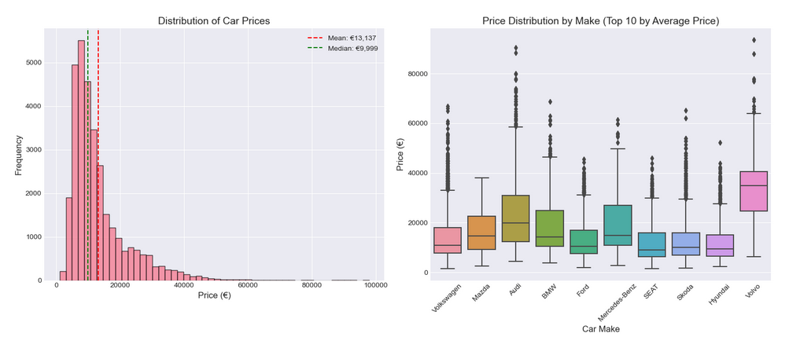
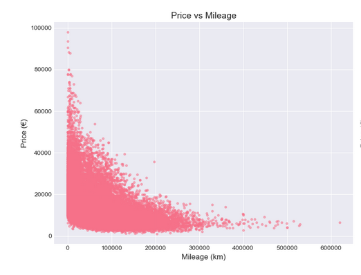
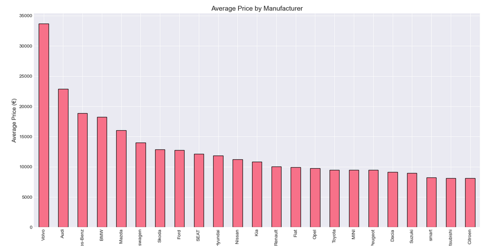

# Germany-used-car-price-analysis
Germany used car market analysis and price prediction using Python, EDA, and machine learning.
# 🇩🇪 Germany Used Car Price Analysis & Prediction

## 📌 Project Overview
This project analyzes the German used car market and builds a machine learning model to predict vehicle prices based on key features such as age, mileage, horsepower, brand, and model.

The objective is to transform raw automotive data into actionable insights and provide accurate price estimation for buyers, sellers, and market analysts.

---

## 📂 Dataset
- **Source:** AutoScout24 Germany  
- **Total Records:** 46,405  
- **Features:** 9 columns  

### Key Data Includes:
- Vehicle Details: Make, Model, Year, Mileage, Horsepower  
- Specifications: Fuel type, Gear type  
- Target Variable: Price (€)  

---

## 🛠️ Tools & Technologies
- Python (Pandas, NumPy)  
- Data Visualization (Matplotlib, Seaborn)  
- Machine Learning (Scikit-learn)  
- Preprocessing (MinMaxScaler, OneHotEncoder, ColumnTransformer)  
- Jupyter Notebook  

---

## 🔍 Project Workflow

### 1. Data Cleaning & Preparation
- Handled missing values (model, gear, horsepower)  
- Created new feature: `car_age`  
- Filtered popular models (≥100 samples)  
- Removed outliers using IQR method  
- Standardized data types  

---

### 2. Exploratory Data Analysis
- Analyzed price distribution across brands and categories  
- Examined relationships between price, mileage, age, and horsepower  
- Identified top manufacturers by average price  

---

### 3. Feature Engineering & Modeling
- Numerical features: Scaling + Polynomial Features  
- Categorical features: One-hot encoding  
- Built Linear Regression model  
- Evaluated using RMSE, MAE, and R²  

---

## 📊 Visual Insights from the Data

### 🔹 Price Distribution

Most vehicles are concentrated in the lower to mid-price range, with a right-skewed distribution.

**Business Insight:**  
The majority of cars are priced below €20,000, indicating strong demand in the affordable segment.

---

### 🔹 Price vs Mileage

This plot shows a clear negative relationship between mileage and price.

**Business Insight:**  
Higher mileage significantly reduces resale value.

---

### 🔹 Average Price by Manufacturer

Comparison of average prices across manufacturers.

**Business Insight:**  
Premium brands such as Audi, BMW, and Mercedes-Benz maintain higher resale value.

---

## 📈 Model Performance

| Metric | Training Set | Test Set |
|-------|------------|---------|
| R² Score | 0.931 | 0.933 |
| RMSE | €1,488 | €1,474 |
| MAE | €1,082 | €1,081 |

The model explains approximately **93% of the variance**, showing strong predictive capability.

---

## 💡 Key Insights
- Car age and mileage are the strongest negative price drivers  
- Horsepower has a strong positive impact on price  
- Premium brands retain higher value over time  
- Diesel vehicles typically retain more value than gasoline cars  
- Automatic transmission adds a price premium  
- Highest depreciation occurs within the first 3–5 years  

---

## 💼 Business Value

### For Buyers
- Best value vehicles are typically 3–5 years old  
- Diesel and automatic cars retain higher resale value  
- Avoid extreme outliers (very high mileage or very old vehicles)  

### For Sellers
- Price vehicles based on comparable listings  
- Highlight key value drivers (low mileage, features)  
- Use model predictions to set competitive prices  

---

## 🚀 What I Learned
- Building end-to-end machine learning pipelines  
- Handling mixed data types using ColumnTransformer  
- Applying feature engineering for better predictions  
- Evaluating models using multiple metrics  
- Translating data analysis into business insights  

---

## 📂 Project Structure
